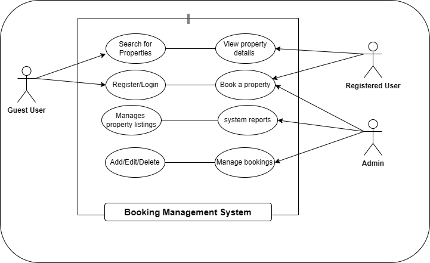

AlX WEEK ONE TASK
---

# 🧩 Requirement Analysis in Software Development
Introduction

This repository serves as the foundation for documenting and understanding the Requirement Analysis phase of the Software Development Life Cycle (SDLC).
It focuses on identifying, analyzing, and documenting the requirements for a Booking Management System—simulating a real-world development scenario.

### The primary goal of this project is to:

- Understand how requirements are gathered, categorized, and validated.

- Develop structured documentation for both functional and non-functional requirements.

- Create clear visual representations using tools like Draw.io.

- Define acceptance criteria that align with technical implementation with business objectives.

This repository will evolve through multiple tasks, each highlighting a critical step in mastering the requirement analysis process and producing industry-standard documentation for scalable software systems.

---

# What is Requirement Analysis?

**Requirement Analysis** is a critical phase in the **Software Development Life Cycle (SDLC)** where the project team gathers, analyzes, and defines the requirements of the software product to be developed. This process ensures that all stakeholders have a clear and mutual understanding of what the system should do and how it should perform.

## Why is Requirement Analysis Important?

* **Clarity and Understanding:** It helps in understanding what the stakeholders expect from the software, reducing ambiguity.
* **Scope Definition:** Clearly defines the scope of the project, which helps in preventing scope creep.
* **Basis for Design and Development:** Provides a solid foundation for designing and developing the system.
* **Cost and Time Estimation:** Facilitates accurate estimation of project cost, resources, and time.
* **Quality Assurance:** Ensures that the final product meets the specified requirements, leading to higher customer satisfaction.

---

## Key Activities in Requirement Analysis

### 1. Requirement Gathering 🗂️

* **Interviews:** Conduct interviews with stakeholders to gather detailed information about their needs and expectations.
* **Surveys/Questionnaires:** Distribute surveys to collect requirements from a larger audience.
* **Workshops:** Organize workshops with stakeholders to discuss and gather requirements.
* **Observation:** Observe end-users in their working environment to understand their needs.
* **Document Analysis:** Review existing documentation and systems to understand current functionalities and requirements.

### 2. Requirement Elicitation ✍️

* **Brainstorming:** Conduct brainstorming sessions to generate ideas and gather requirements.
* **Focus Groups:** Hold focus group discussions with selected stakeholders to gather detailed requirements.
* **Prototyping:** Create prototypes to help stakeholders visualize the system and refine their requirements.

### 3. Requirement Documentation 📚

* **Requirement Specification Document:** Create a detailed document listing all functional and non-functional requirements.
* **User Stories:** Write user stories to describe functionalities from the user’s perspective.
* **Use Cases:** Create use case diagrams to show interactions between users and the system.

### 4. Requirement Analysis and Modeling 📊

* **Requirement Prioritization:** Prioritize requirements based on their importance and impact on the project.
* **Feasibility Analysis:** Assess feasibility in terms of technical, financial, and time constraints.
* **Modeling:** Create models (e.g., data flow diagrams, entity-relationship diagrams) to visualize and analyze requirements.

### 5. Requirement Validation ✅

* **Review and Approval:** Review documented requirements with stakeholders for accuracy and completeness.
* **Acceptance Criteria:** Define clear acceptance criteria for each requirement.
* **Traceability:** Establish traceability matrices to ensure all requirements are addressed during development and testing.

---

## Types of Requirements

### Functional Requirements ⚙️

**Definition:** Describe what the system should do.

**Examples:** User authentication, property search, booking system, user registration.

**Key Functional Requirements:**

* Search Properties: Users can search for properties by location, price, and availability.
* User Registration: Users can create accounts with personal details and login credentials.
* Property Listings: Display properties with essential details and images.
* Booking System: Users can book properties, view booking details, and manage bookings.
* User Authentication: Secure login and registration process.

### Non-functional Requirements 🛡️

**Definition:** Describe how the system should perform.

**Examples:** Performance, security, scalability, usability, reliability.

**Key Non-functional Requirements:**

* **Performance:** The system should load pages within 2 seconds and handle up to 1,000 concurrent users.
* **Security:** Ensure data encryption, secure login, and protection against vulnerabilities.
* **Scalability:** The system should scale horizontally to handle increased traffic.
* **Usability:** The application should have an intuitive UI/UX for easy navigation.
* **Reliability:** Maintain 99.9% uptime and quick recovery from failures.

---

## Requirement Analysis Process

1. **Requirement Gathering:** Engage stakeholders and collect initial requirements through interviews, surveys, and workshops.
2. **Requirement Elicitation:** Refine and elaborate requirements using brainstorming, focus groups, and prototyping.
3. **Requirement Documentation:** Document requirements in a structured format — specification docs, user stories, and use cases.
4. **Requirement Analysis and Modeling:** Analyze and prioritize requirements; create models for visualization and understanding.
5. **Requirement Validation:** Review and validate requirements, define acceptance criteria, and ensure traceability.

---

## 💡 Why is Requirement Analysis Important?

Requirement Analysis is a vital phase in the Software Development Life Cycle (SDLC) because it lays the foundation for all subsequent stages of the project. A well-defined requirement analysis ensures that developers, stakeholders, and users share a unified understanding of the system’s goals and expectations.
Below are three key reasons why this phase is critical:

### 1. Prevents Miscommunication and Scope Creep

Requirement analysis bridges the communication gap between stakeholders and the development team. Clearly defined requirements help prevent misunderstandings, minimize rework, and reduce the risk of scope creep, by ensuring that the final product aligns with the client’s expectations.

### 2. Saves Time and Cost

By identifying potential issues early and defining the system’s needs precisely, requirement analysis minimizes design errors, development delays, and costly post-deployment fixes. This proactive approach ensures resources are used efficiently throughout the project lifecycle.

### 3. Serves as a Blueprint for Development

Requirement analysis produces structured documentation; including functional, non-functional, and user requirements, that guides developers, testers, and designers. This blueprint ensures consistency, improves collaboration, and forms the basis for validation and acceptance testing.

---

## Use Case Diagrams

### What are Use Case Diagrams?
A **Use Case Diagram** is a visual representation of how different users (called *actors*) interact with a system to achieve specific goals (*use cases*).  
It helps in identifying the functionalities the system must support and clarifies relationships between users and system features.

### Benefits of Use Case Diagrams
- **Clarifies System Scope:** Helps both developers and stakeholders understand what the system will and won’t do.  
- **Improves Communication:** Provides a clear and simple visual tool for discussing system interactions.  
- **Identifies Actors and Use Cases:** Makes it easy to visualize which users perform which actions.  
- **Facilitates Requirement Validation:** Ensures all key functionalities are captured and aligned with business needs.

---

### Booking Management System – Use Case Diagram

Below is the use case diagram for the **Booking Management System**. It shows how various users interact with the system to perform different operations.

#### **Actors**
- **Guest User:** Can search for properties and view details.  
- **Registered User:** Can search, book properties, manage bookings, and view booking history.  
- **Admin:** Manages property listings, user accounts, and system reports.

#### **Use Cases**
- Search for properties  
- View property details  
- Register/Login  
- Book a property  
- Manage bookings  
- Add/Edit/Delete property listings  
- Generate reports  

---

### 📊 **Use Case Diagram**

*Figure: Use Case Diagram for the Booking Management System.*

---

## Acceptance Criteria

### What is Acceptance Criteria?
**Acceptance Criteria** are specific, predefined conditions that a software feature must meet to be accepted by stakeholders.  
They define what success looks like for a feature and ensure that the final product aligns with business goals and user expectations.

Acceptance criteria serve as a **bridge between requirements and testing**, helping both developers and testers understand exactly what needs to be built and validated.

---

### Importance of Acceptance Criteria
- **Clarity and Alignment:** Ensures all stakeholders share a clear understanding of what a feature should do.  
- **Guides Development:** Acts as a checklist for developers to know when a feature is complete.  
- **Improves Testing:** Provides measurable standards for QA teams to verify whether the feature works as intended.  
- **Reduces Miscommunication:** Minimizes ambiguity by setting clear and testable expectations before development begins.  
- **Supports Agile Practices:** In Agile environments, acceptance criteria help define the “Done” condition for user stories.

---

### Example: Checkout Feature (Booking Management System)
Below is an example of well-defined acceptance criteria for the **Checkout Feature** in the Booking Management System.

#### **Feature:** Checkout Process for Property Booking  

| **ID** | **Acceptance Criteria** | **Priority** | **Status** |
|:-------|:-------------------------|:-------------|:------------|
| AC-01 | Users must be able to view a summary of their selected property before payment. | High | Pending |
| AC-02 | The system must display the total cost, including taxes and service charges, before confirmation. | High | Pending |
| AC-03 | Users must be able to choose a payment method (Credit Card, PayPal, Bank Transfer). | High | Pending |
| AC-04 | On successful payment, the user should receive a confirmation message and email within 2 minutes. | High | Pending |
| AC-05 | If payment fails, the system should display an appropriate error message and allow retry. | Medium | Pending |
| AC-06 | Booking details should be saved automatically in the user’s account upon successful payment. | High | Pending |

---

### ✅ Benefits of Well-Defined Acceptance Criteria
- Ensures consistent understanding among team members.  
- Improves software quality by setting measurable success conditions.  
- Helps in validating that all user requirements have been met.  
- Serves as a reference during project reviews and quality assurance.

---

*Figure: Acceptance criteria define when a feature is considered complete and acceptable for release.*
